# Git 和 Github 使用方法（基本完结）

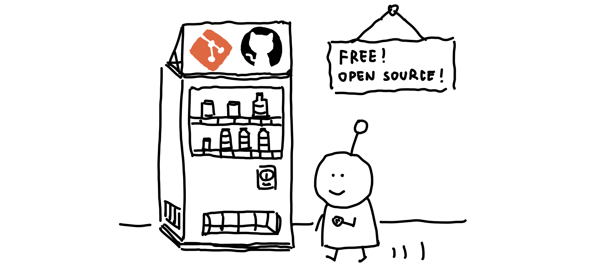

## 0 目录

- [Git 的相关指令和 Github 使用方法（未完结）](#git-的相关指令和-github-使用方法未完结)
  * [0 目录](#0-目录)
  * [1 Git 安装与本地的 Git 仓库管理](#1-git-安装与本地的-git-仓库管理)
    * [1.1 安装（Windows）](#11-安装windows)
    * [1.2 本地仓库管理](#12-本地仓库管理)
      * [1.2.1 新建仓库](#121-新建仓库)
      * [1.2.2 删除仓库](#122-删除仓库)
  * [2 Github 的仓库管理](#2-github-的仓库管理)
  * [3 （新建）远程 Github 仓库与本地仓库关联](#3-新建远程-github-仓库与本地仓库关联)
    + [3.1 创建 github 仓库](#31-创建-github-仓库)
    + [3.2 创建本地仓库](#32-创建本地仓库)
    + [3.3 配置 SSH](#33-配置-ssh)
    + [3.4 同步远程到本地](#34-同步远程到本地)
  * [4 本地库的修改，提交与远程同步](#4-本地库的修改提交与远程同步)
  * [5 克隆远程仓库到本地](#5-克隆远程仓库到本地)
    * [5.1 克隆仓库](#51-克隆仓库)
    * [5.2 选择分支](#52-选择分支)
  * [6 拉取最新版本的远程仓库](#6-拉取最新版本的远程仓库)
    * [6.1 版本比较](#61-版本比较)
    * [6.2 拉取最新版本](#62-拉取最新版本)
    * [6.3 提醒事项](#63-提醒事项)
  * [7 管理分支](#7-管理分支)
    * [7.1 新建分支](#71-新建分支)
    * [7.2 合并分支Github端](#72-合并分支github端)
    * [7.3 合并分支GitBash端](#73-合并分支gitbash端)
  * [8 版本回退](#8-版本回退)
    * [8.1 hard reset](#81-hard-reset)
    * [8.2 soft reset](#82-soft-reset)
    * [8.3 对比 hard 和 soft reset](#83-对比-hard-和-soft-reset)
    * [8.4 情景模拟](#84-情景模拟)
- [Appendix 附录](#appendix-附录)
  - [A.1 相关资料补充](#a1-相关资料补充)
- [鸣谢](#鸣谢)

## 1 Git 安装与本地的 Git 仓库管理

### 1.1 安装（Windows）

首先，在官网https://git-scm.com/download/win下载 Git 的Windows版安装包并安装：


安装过程省略，按默认的来就可以了，完成后菜单里会多出几个 Git 的相关程序，找到 `Git Bash`并打开，进入命令行。由于 Git 最初是在 Linux 上用来做版本控制的工具，并不支持 MacOS，Windows 系统，所以我们使用的`Git Bash`是 Linux 风格移植过来的控制台，与 Windows 的 `Powershell` `CMD` 有不少区别，需要使用 Linux 的相关指令进行操作，**可能需要一点 Linux 基础**。

首次使用我们需要为 Git 设置用户名和账号，这样才能让你的机器在分布式的仓库系统中有“身份证”，使用以下命令指定用户名和邮箱账号：

```
git config --global user.name "your-name"
git config --global user.email "your-email@example.com"
```

需要注意 `--global` 参数表示此机器上所有的仓库都会使用此身份配置。

[返回目录](#0-目录)

### 1.2 本地仓库管理

**我们对于 Git 仓库的管理，比如新建、删除、同步、版本控制，都需要在 `Git Bash` 里面使用指令进行**。在我们的硬盘里， Git 仓库和普通文件夹最本质的区别是前者有`.git`这个隐藏目录，`.git`里面存放的是关于仓库的各种信息，比如说各个版本对应的文件hooks、用户配置、暂存缓存、logs这些保证仓库正常运行的材料，一般情况下不要去修改`.git`的文件，以防止仓库运行出现错误:pig:。

[返回目录](#0-目录)

#### 1.2.1 新建仓库

新建仓库的步骤是先使用`mkdir`新建目录，然后进入目录中使用`git init`将目录初始化为一个空的仓库，即增加了`.git`组件并设置为`master`分支，这样一个仓库就新建好了：

```
mkdir my_repo
cd my_repo && git init
```


[返回目录](#0-目录)

#### 1.2.2 删除仓库

因为`.git`是仓库管理组件，只要将`.git`删除就可以将它从 Git 仓库变回普通目录；如果想要连同内容一起删除，那直接删除整个仓库目录即可。在 `Git Bash` 中使用 `rm -rf` 命令移除目录：

```
# 删除 .git，可以看见分支提示(master)也消失了，变回普通文件夹目录
rm -rf .git/

# 删除整个my_repo仓库（包括内容），然后退回刷新内存，此时my_repo目录已经不见
rm -rf ../my_repo
cd ..
```


[返回目录](#0-目录)

## 2 Github 的仓库管理

...... （这个比较简单）

## 3 （新建）远程 Github 仓库与本地仓库关联

### 3.1 创建 github 仓库

首先要在 Github 中创建一个仓库，比如说`Aldenhovel/git-demo`，采用默认的设置就好了。


[返回目录](#0-目录)

### 3.2 创建本地仓库

然后我们在本地也创建一个仓库，在`git bash`中新建一个`git-demo`目录，然后使用：

```
git init
```

来初始化，这一步相当于新增了`.git`组件，把这个目录变成 git 仓库，默认的分支参数是`master`。


[返回目录](#0-目录)

### 3.3 配置 SSH

Github 与本地的通信需要使用 SSH 来验证身份，所以要生成 SSH 密钥，在`git bash`中输入（记得换成你自己的邮箱）：

```
ssh-keygen -t rsa -C "your-email@example.com"
```

然后回车即可得到生成的 SSH 密钥，存放在用户主目录下的`.ssh`下，其中生成的两个文件：

- `id_rsa` 是你的私钥，注意小心保管不要泄露。
- `id_rsa.pub`是公钥，我们在 Github 上提交的 SSH 密钥就是这个。


我们切换到对应目录下，用文本方式打开`id_rsa.pub`文件，将里面的内容复制下来。然后打开 Github 主页，在个人设置中找到`SSH and GPG keys`选项，点击`New SSH key`按钮：


将在`id_rsa.pub`中的公钥复制过来，可以改个名字方便管理，然后点击添加：


完成后就可以在列表中看到你的密钥：


[返回目录](#0-目录)

### 3.4 同步远程到本地

现在我们已经有了三大法宝：

- 远程的 Github 仓库。
- 本地的 Git 仓库。
- 配置好的用于远程和本地通信的 SSH 密钥。

可以进行本地和远程的双向同步了。首先是我比较喜欢的做法：在远程创建仓库，再同步到本地，然后在本地编辑完成后推送到远程，这么做比较简单。

首先我们在 Github 上找到 `Aldenhovel/git-demo` 仓库的 SSH 地址（用 HTTPS 也可以），把地址复制下来：


前面使用`git init`会产生默认为`master`的分支，因为这是我们自己的库，我们重命名为`main`分支（在 Github 端新建的仓库从 2020 年 10 月开始默认主分支为 `main`，而在 Git 中默认为 `master`，如果想要将本地分支与远程仓库主分支联系则需要手动用`git branch -M <new name>` 将分支重命名让两边一致）：

```
git branch -M main
# P.S git branch -M 命令执行的是强制重命名，想要新建分支，请使用 git checkout -b 命令
```


然后在`git bash`里面使用：

```
git remote add git-demo-origin git@github.com:Aldenhovel/git-demo.git
```

将他关联过来，这里的`git-demo-origin`是给远程仓库起的名，一般远程库默认叫`origin`[(什么是origin)](#origin-meaning)<span id='r-origin-meaning'>，也可以改别的名字比如`xx-origin`（我的习惯）：


这句命令的意思是将 `git@github.com:Aldenhovel/git-demo.git` 这个远程仓库记录为 `git-demo-origin` ，这样下次推送、同步就可以用简写名代替了现在本地库和远程库就产生了关联。

[返回目录](#0-目录)

## 4 本地库的修改，提交与远程同步

假设我们现在每日的工作是在本地库做修改，完成后再统一推送到远程，这个过程需要使用三个步骤对应三个命令 `add` `commit` `push`：

1. `add` 将新的、修改过的文件提交到本地的缓冲区。
2. `commit` 将缓冲区的文件提交到本地库并完成本地更改。
3. `push` 将本地库推送到远程库完成同步。

为什么需要 `add` 和 `commit` 分开，这是为了数据修改安全所设计的步骤逻辑，即所有修改要么一次全部改完要么完全不动，以防止修改过程中出现的突发情况导致文件部分修改而混乱（数据库的内容）。

我们尝试编辑一个`readme.md`文档并把它推送到 Github，随便写点东西：


使用`add`命令可以将文件添加到缓冲区，可以逐个文件添加，也可以在库的主目录下使用`.`将整个库添加：

```
git add .
```

然后用`commit`命令提交到本地库，注意`-m`是评论参数，你需要对你的提交加一点说明：

```
git commit -m "version 0.1"
```

最后使用`push`命令将本地 `main` 远程同步到远程仓库 `git-demo-origin`：

```
git push -u git-demo-origin main
```


没有出什么差错就好:pig:。最后我们检查 Github 发现信息已经同步过去啦：


[返回目录](#0-目录)

## 5 克隆远程仓库到本地

### 5.1 克隆仓库

前面的是从0开始先建立 Github 仓库，再关联本地，最后在本地编辑项目并同步到本地。多数时候我们不需要从0开始建立仓库，而是在新的设备上将 Github 上的库拉下来开始上手干活。这里我们假设在本地建立一个`git-demo-2`仓库，并同步远程`Aldenhovel/git-demo`仓库。

使用`git clone`指令将远程仓库克隆到本地，因为我们现在已经有了一个`git-demo`本地库了，需要重新指定本地库名以防止冲突：

```
git clone git@github.com:Aldenhovel/git-demo.git git-demo-2
# git clone <远程仓库地址> <本地目录>
```


然后我们将这个新的库与`Aldenhovel/git-demo`远程库做关联：

```
git remote add git-demo-2 git@github.com:Aldenhovel/git-demo.git
```


后面就与前面的步骤一样啦，首先我们修改下`readme.md`：


然后，使用`add` `commit` `push` 来推送同步：

```
git add .
```

```
git commit -m "readme.md changed"
```

```
git push -u git-demo-2 main
```


完成，没有报错:pig:，去 Github 上检查下，发现已经同步成功：


[返回目录](#0-目录)

### 5.2 选择分支 

请参考 [克隆某一仓库某一分支](#clone-branch) <span id='r-clone-branch'>。

[返回目录](#0-目录)

## 6 拉取最新版本的远程仓库

先说明下在 Git 指令里面 `clone` `fetch` `pull` 的区别：

- `clone` 指令可以直接将远程仓库整个克隆过来，完全从无到有，不需要做任何`init`的操作。
- `fetch` 指令将现有的仓库与远程的仓库做对比，将远程新的版本变化拉到本地。
- `pull` 指令是 `fetch` 与 `merge` 的结合，将远程仓库的拉取到本地并合并。

`fetch`和`pull`指令的主要区别是将远程的信息拉过来后是否需要直接合并，比较严谨的情况下，先将远程仓库`fetch`过来，经过检查后再`merge`是比较好的，但是方便起见我们直接使用`pull`比较多的。

[返回目录](#0-目录)

### 6.1 版本比较

Git 可以辨认不同的版本，但是它不是逐个文件逐字句地看你的文件，检查有没有修改来判断是否同一版本的，而是采用版本号来判断版本。以`Aldenhovel/git-demo`为例，在 Github 上，你的远程仓库当前版本在这个地方显示：

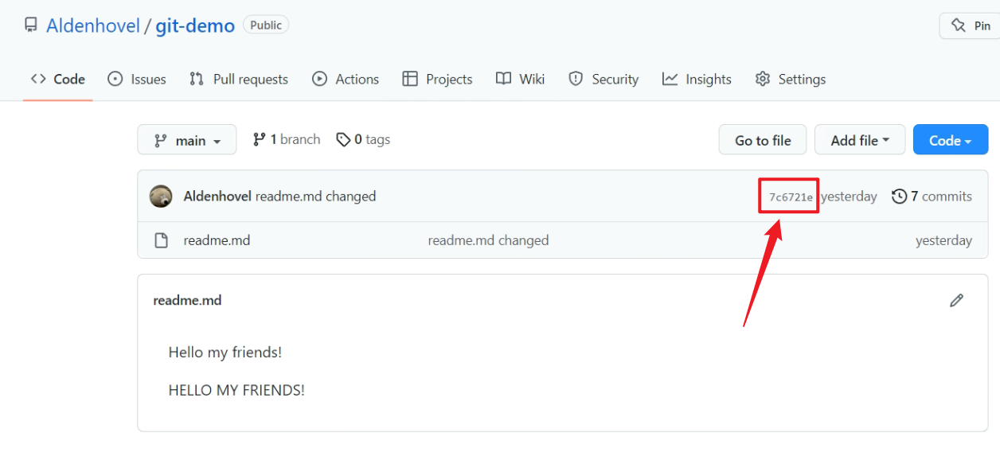

在本地中，可以在`Git Bash`中通过`reflog`指令来检查版本：

```
git reflog
```

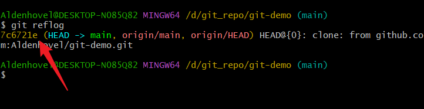

[返回目录](#0-目录)

### 6.2 拉取最新版本

当远程或者本地的仓库经过`commit`提交后，仓库版本号就会变化，需要我们手动同步，由本地到远程，我们使用`push`方法，而从远程到本地，我们使用`pull`方法。

首先我们要确保远程仓库版本与本地不同，即远程仓库的版本更新，在 Github 端，我们手动改一下`readme.md`并提交，可以看到版本号已经变化：

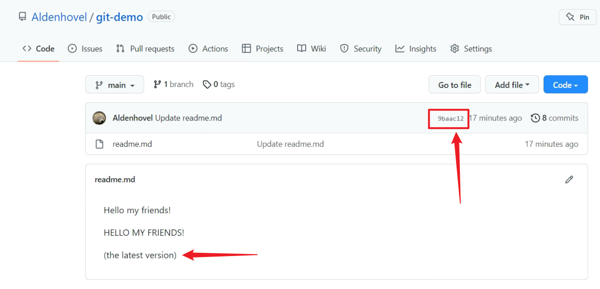

使用这个命令也可以检查：

```
git remote show git-demo-origin
# "git-demo-origin" 这个名是之前用 git remote add 添加的，一般情况对应 origin
```

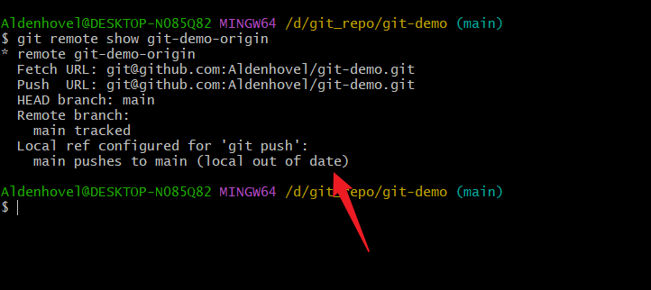

出现`(local out of date)`说明远程仓库有更新版本，可以使用`pull`拉取，由于从远程的 `git-demo-origin` 拉取到本地的 `main`，我们这样写：

```
git pull git-demo-origin main
```

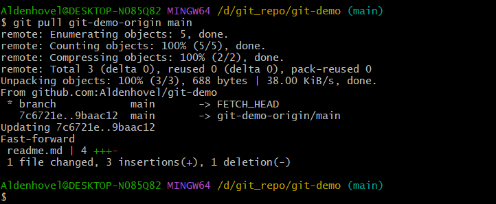

可以看到远程的 `main` 分支里面对 `readme.md` 的修改已经被拉取到本地，在本地中打开检查下：

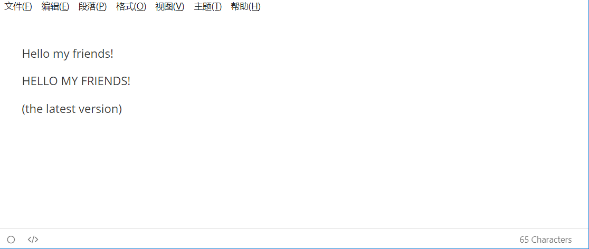

完成无误！:heavy_check_mark:

[返回目录](#0-目录)

### 6.3 提醒事项

1. 在远程仓库不能将老的版本`pull`到本地（即用`pull`来进行版本回退），不然可能会遇到各种问题，想要在本地恢复远程仓库的版本，最好直接重新`clone`一个，或者采用`reset --hard`方法来切换回旧的版本。`pull`该做的就是老老实实地同步远程仓库的最新版本。
2. 当多个分支需要合并时，直接合并内容可能会发生冲突，一般先将远程的最新的仓库`pull`下来，本地合并后再`push`上去。
3. 注意版本号和`commit`，有时没有变化可能是修改的文件没有`commit`，导致版本号没有变化，Git 认为不需要进行操作。

[返回目录](#0-目录)

## 7 管理分支

Github 提倡的就是代码的开源共享，将仓库开放，人人都可以访问，大家齐心协力一起想办法解决问题（这是不是共产主义？）。因此我们或多或少都会遇到多人协同的开发情境，除了用`push`和`pull`进行本地与远程的代码同步外，多人协同开发最大的问题是合并大家的代码，这就需要在开始时产生分支，等完成后再合并到一起。本章节我们模拟新建一个分支，修改内容，然后再与主分支合并。

[返回目录](#0-目录)

### 7.1 新建分支

以`Aldenhovel/git-demo`库为例，这里我们在`readme.md`里说明了是主分支，并且已经通过`pull`或者`push`方法将本地与远程仓库关联：

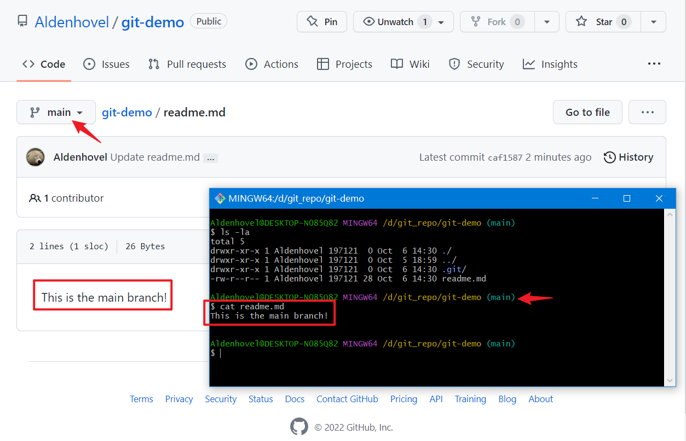

然后我们在本地新建一个`dev`分支：

```
git checkout -b dev
# 用 git checkout <name> 来切换分支， -b 为新建并切换
```

注意这时分支提示已经显示`(dev)`，也可以使用`git branch`看到已经有了`dev`分支。我们将`readme.md`也稍作修改（记得`add`和`commit`）：

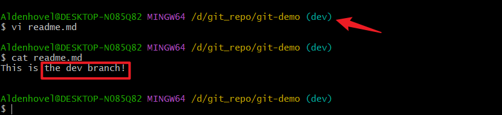

这时`main`和`dev`分支已经产生了不同，如果需要修改分支文件，需要先用`git checkout <name>`来换到对应的分支再改，因为在不同分支下，文件的内容是不同的，如下：

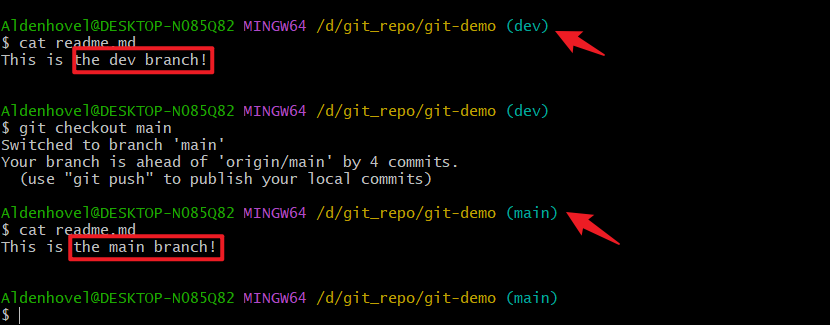

现在我们已经有了两个互相独立的分支，即`main`为主分支、`dev`为开发分支，我们在`dev`上面做自己对应部分的工作，完成后再合并到`main`分支上。

[返回目录](#0-目录)

### 7.2 合并分支Github端

假设现在我们的工作做得差不多了，需要将`dev`分支的内容合并到`main`分支，有两种思路：其一是将自己的`dev`分支在本地与`main`合并，再`push`上去；其二是先将`dev`分支`push`上去，再在 Github 上使用`pull request`合并。这里使用第二种方法：先将`dev`同步到 Github 上：

```
git push git-demo-origin dev
# 注意这里最后的参数从 main 换成 dev，即会推送到 dev 分支上
```

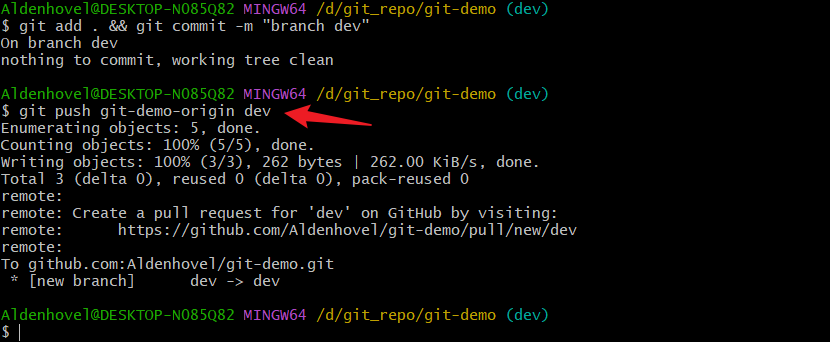

在 Github 端，我们看到 `dev` 已经推送上来可以访问了：

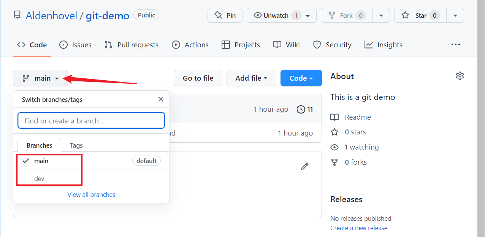

我们切换到 `dev` 分支，可以看到有`pull request`的提示，这是合并代码的入口：

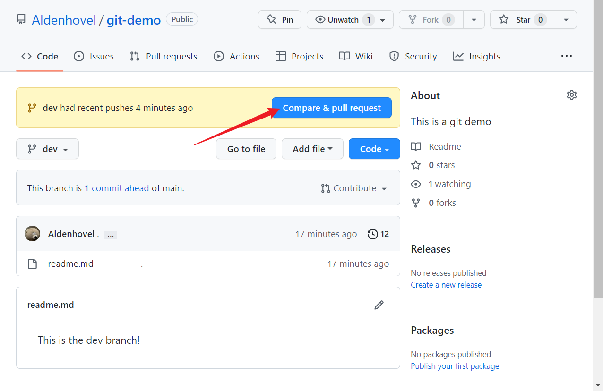

进去后，可以先进行代码的对比，在这里选择将哪两个分支进行合并，如果没有冲突，会显示`Able to merge`的提示，点击`Create pull request`下一步：

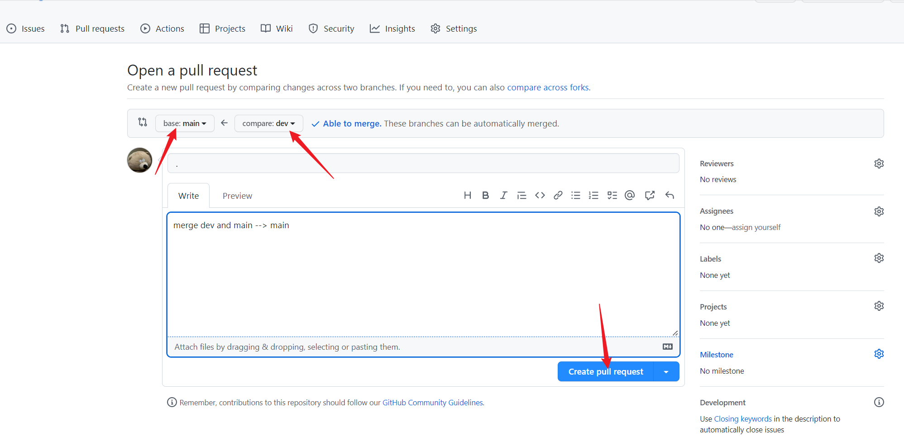

在这一步中系统会做最后检查，如无意外，点击`Merge pull request`进行自动合并：

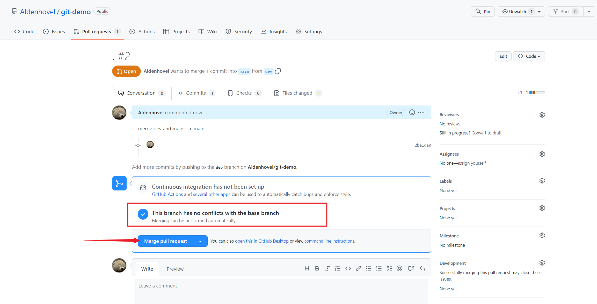

完成，系统会提示是否需要删除`dev`分支，可以直接点击删除，也可以回来在`Git Bash`中先把合并后的`main`拉下来，再使用指令将本地和远程的`dev`分支删除：

```
git checkout main
# 切换回主分支

git pull git-demo-origin main
# 同步主分支

git branch --delete dev
# 删除本地 dev 分支

git push git-demo-origin --delete dev
# 删除远程 dev 分支
```

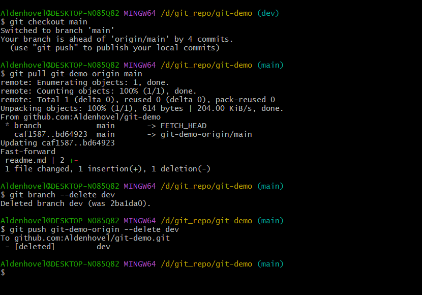

此时本地和远程都只剩下合并后的 `main` 分支，大功告成！

[返回目录](#0-目录)

### 7.3 合并分支GitBash端

补充前面提到的第一种做法：将 `dev` 在本地与 `main` 合并后再 `push` 到远程仓库。首先在 `main` 分支拉取一下最新进度，然后使用 `merge` 或者 `rebase` 命令将 `dev` 与 `main` 合并[（关于合并参数）](#ff-and-noff)<span id='r-ff-and-noff'> [（关于merge和rebase）](#merge-and-rebase)<span id='r-merge-and-rebase'>：

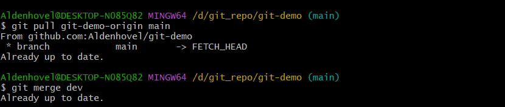

没有报错，此时在本地的 `main` 已经成功合并了`dev` 分支了，然后我们需要 `add, commit & push` 将 `main` 推送到远程仓库并检查，发现 `main` 已经成功合并了 `dev` 的修改内容：

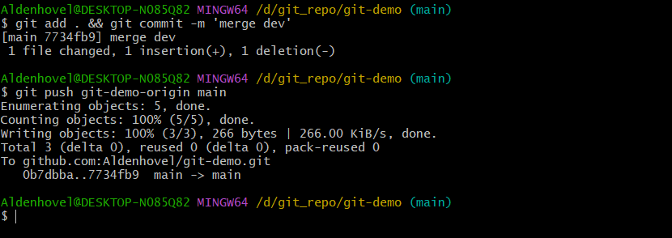

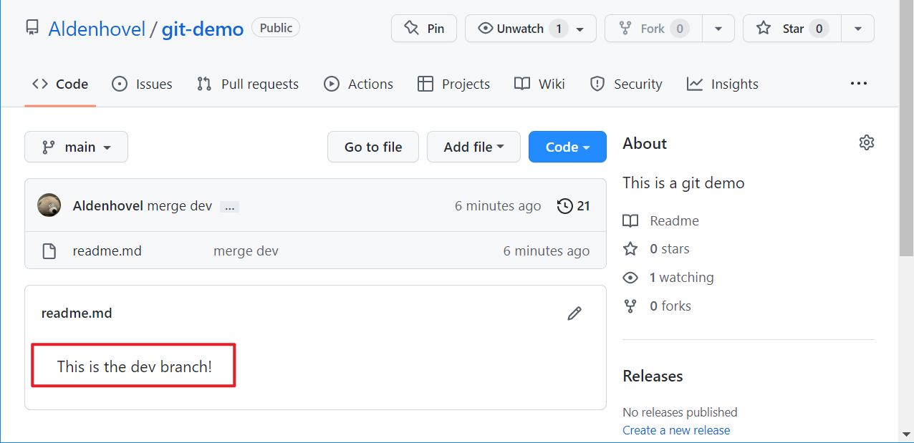

最后我们选择性地删除本地 `dev` 分支（由于 `dev` 分支从头到尾都在本地新建、合并、修改，因此远程仓库里并没有 `dev` 分支）:

```
git branch --delete dev
```

[返回目录](#0-目录)

## 8 版本回退

Git 的重要功能之一，版本控制可以将过去的仓库状态快速恢复出来，即版本回退。在`Git Bash`中，主要使用`reset`命令进行回退，而且还要区分`soft`模式和`hard`模式的版本回退。这里我们继续用`Aldenhovel/git-demo`作为示例。首先我们先`commit`一个旧版本`version 1.0`并写在`readme.md`中作为初始版本：

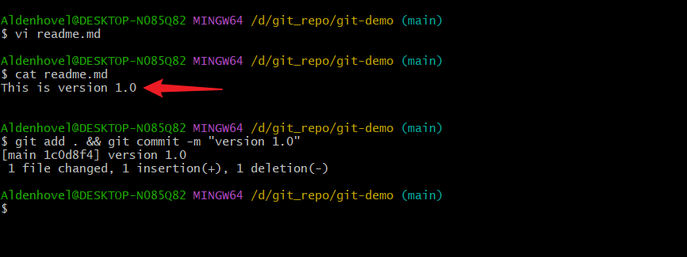

然后再`commit`一个`version 2.0`作为新版本：

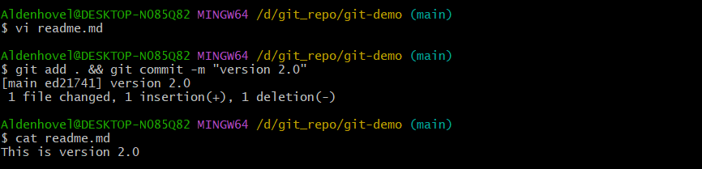

通过使用`reflog`命令，可以查看到过去的各个版本号和注释：

```
git reflog
```

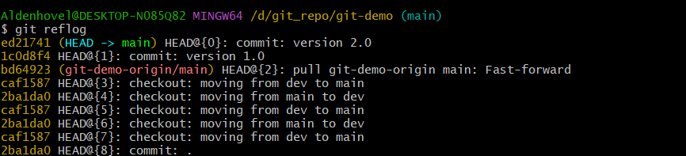

可以看到 `version 1.0` 的版本号为 `1c0d8f4` ， `version 2.0` 的版本号为 `ed21741` ，目前指针指向 `ed21741` 。

[返回目录](#0-目录)

### 8.1 hard reset

`reset --hard` 是实现硬回退的指令，所谓硬回退，就是将工作目录、暂存区、历史提交全部回退到目标位置，在此位置后修改的内容全部丢失。现在我们尝试使用此命令回到 `1c0d8f4` 版本：

```
git reset --hard 1c0d8f4
```

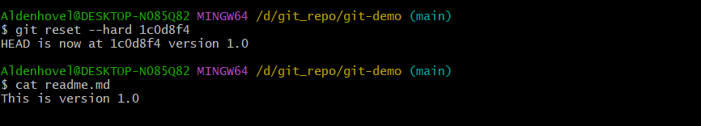

可以看到指针已经指向 `1c0d8f4` ，而且 `readme.md` 也恢复了 `version 1.0` 。需要说明一下的就是我们将`version 2.0`硬回退到`version 1.0` 后，前者又成了历史版本，我们同样可以使用：

```
git reset --hard ed21741
```

将 `version 1.0` 版本 “回退” 到 `version 2.0` ，因此这里的 “回退” 指的是相对版本的重新载入，而不是时间倒流！

[返回目录](#0-目录)

### 8.2 soft reset

`reset --soft` 软回退相对于硬回退，最大的区别是只将版本号回退而不将工作区内容回退，即你的修改内容不会丢失，而是被放到了缓冲区，通过`add & commit` 又可以回到 `soft reset` 前的状态。

[返回目录](#0-目录)

### 8.3 对比 hard 和 soft reset

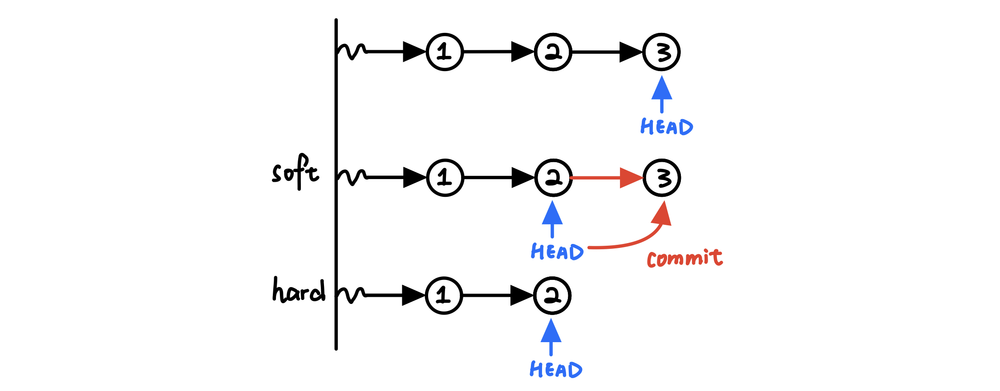

举个栗子，在版本 `1` `2` `3` 中， `3` 是目前版本，使用 `soft reset` 可以退回到 `2` 的版本号，但对比 `3` 的修改会转移到缓冲区，只需要一个 `commit` 指令就可以重新回到 `3` ；而使用 `hard reset` 除了版本号回退外， `3` 里面所有的修改也被擦除了，只能重新编写提交。

再举个栗子，有时我们 `commit` 错了对象，需要重新 `commit` ，不需要更改内容只要将版本号回退重新 `commit` 即可，这时我们用 `soft reset`。然鹅有时我们的仓库代码出现了比较严重的漏洞，需要回退到安全版本，就需要 `hard reset` 。

除了使用版本号指定回退位置，也可以使用`HEAD` [(什么是HEAD)](#what-is-head)<span id='r-what-is-head'>加 `^` 或者 `~` 来表示以当前版本的相对位置，例如：

```
git reset --hard HEAD^		回退1个版本
git reset --hard HEAD^^		回退2个版本
git reset --hard HEAD^^^	回退3个版本
......						

git reset --hard HEAD~		回退1个版本
git reset --hard HEAD~2		回退2个版本
git reset --hard HEAD~3		回退3个版本
......
```

[返回目录](#0-目录)

### 8.4 情景模拟

1. **不小心把要创建新分支 `dev` 的内容提交到了 `main` 上：**

   首先以当前 `main` 分支新建一个 `dev` 分支：

   ```
   git branch dev
   ```

   然后回退 `main` 到上一版本：

   ```
   git reset -- hard HEAD~
   ```

   最后切换回 `newdev` 分支即可：

   ```
   git checkout dev
   ```

   (注意此方法只针对你自己的本地仓库可行，线上随便乱回退会被队友拿来祭天吧？)

2. **不小心把要提交到 `dev` 的内容提交到了 `main` 上：**

   这时我们先软回退到 `main` 的上个版本，然后使用`stash` 将未提交内容转移到堆栈：

   ```
   git reset --soft HEAD~
   git stash
   ```

   然后切换回对的分支，使用 `pop` 弹出堆栈内容，然后 `add & commit` ：

   ```
   git checkout dev
   git stash pop
   git add .
   git commit -m "......"
   ```

   这样就可以啦！关于 `stash` 指令的说明，请看这里[stash指令的作用](#stash)<span id='r-stash'>。

   [返回目录](#0-目录)

## 9 .gitignore

`.gitignore` 文件会指示每次 `commit` 时忽略哪些文件，一般是某些运行缓存、临时图片、或者日志，这些我们只在本地会用到，因此不需要同步到仓库里。

仓库初始化时是不包括 `.gitignore` 文件的，需要自己手动添加，这里我们依然使用 `Aldenhovel/git-demo` 仓库来演示，首先新建 `.gitignore` 文件，以及模拟一个 `temp.log` 日志文件：

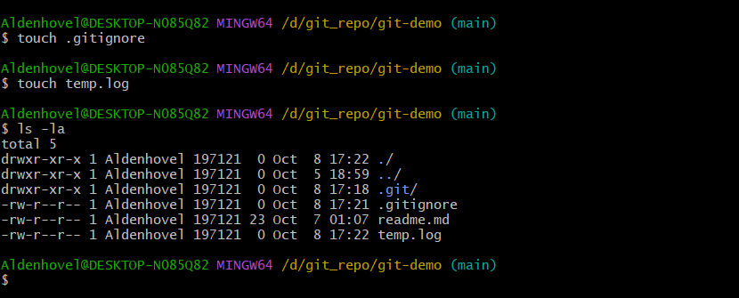

由于还没有编写 `.gitignore` 规则，如果此时直接 `add, commit & push` ，临时日志文件 `temp.log` 也会被同步到仓库里面，因此我们在 `.gitignore` 中加入规则以过滤 `temp.log` ：

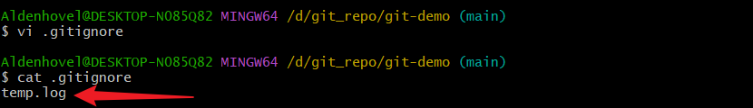

然后我们`add, commit & push`，可以看到 `.gitignore` 文件已经被正确同步到 Github ，而 `temp.log` 则按照规则被过滤，没有加入仓库：

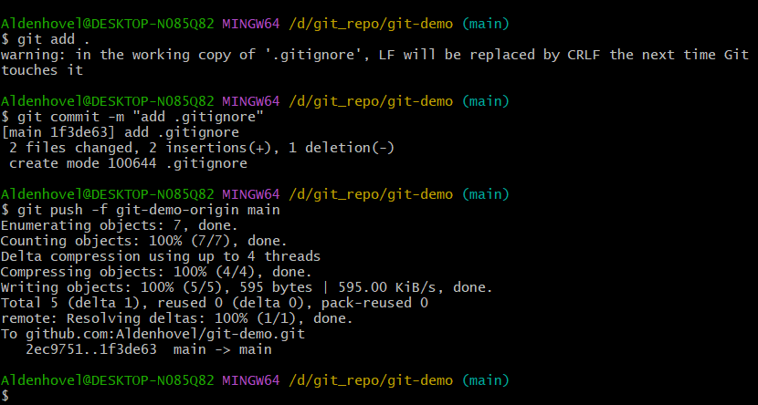

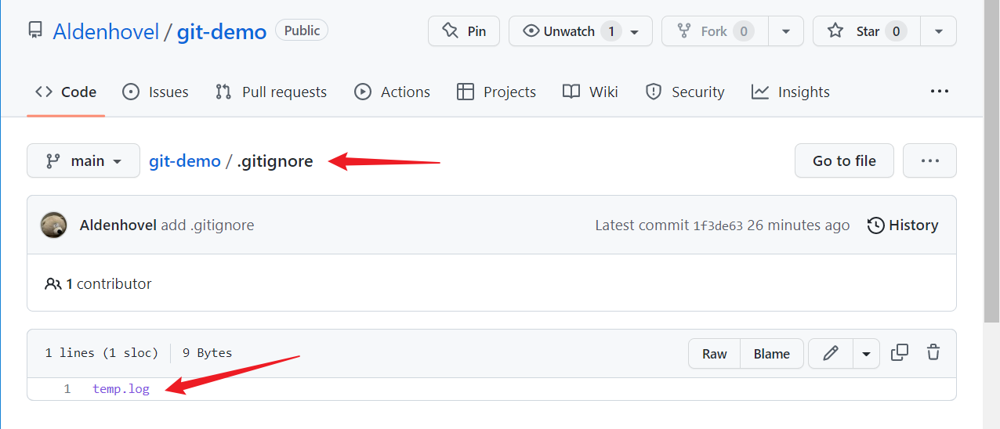

`.gitignore` 规则的编写方式可以参考以下示例：

```
temp.log		忽略 temp.log 文件
! temp.log		不忽略 temp.log 文件
temp/			忽略 temp 文件夹
/temp			忽略根目录下的 temp 文件
temp/*			忽略 temp 文件夹内的所有内容（但文件夹本身不忽略）
temp/*.log		忽略 temp 文件夹内直接包含的所有 .log 后缀的文件（temp/xx/xx.log不受影响）
temp/**/*.log	忽略 temp 文件夹内直接及间接包含的所有 .log 后缀的文件（temp/xx/xx.log也会忽略）
```

[返回目录](#0-目录)

# Appendix 附录

## A.1 相关资料补充

1. **`origin` 的含义**<span id='origin-meaning'>

   你的代码库 (repository) 可以存放在你的电脑里，同时你也可以把代码库托管到 Github 的服务器上。在默认情况下，`origin`指向的就是你本地的代码库托管在Github上的版本。使用：

   ```
   git remote -v
   ```

   可以查询到各个远程仓库的代号名，以及 `fetch / pull` 和 `push` 操作指向的远程仓库地址。使用：

   ```
   git remote add <代号> <远程仓库地址.git>
   ```

   可以新建本地和对应远程仓库的关联，以方便后续开发的`fetch / pull` `push` 操作。

   *参考文献：https://www.php.cn/tool/git/487235.html*

   [返回目录](#0-目录)	[返回章节 4](#r-origin-meaning)

2. **克隆某一仓库某一分支**<span id='clone-branch'/>

   在使用 `git clone xxx.git` 时，如果没有其他参数，是会把整个远程仓库克隆过来的，但是在本地只会创建出默认的 `master` 分支，如果需要获取仓库的某一分支，需要先使用：

   ```
   git branch -a
   ```

   查询可用的分支，再使用：

   ```
   $ git checkout -b <分支名> origin/<分支名>
   ```

   创建并加载此分支。

   *参考文献：https://www.cnblogs.com/FengZeng666/p/16500352.html*

   [返回目录](#0-目录)	[返回章节 5.2](#r-clone-branch)

3. **stash指令**<span id='stash'/>

   设想这样一种工作情景，你在 `dev` 分支上开发新特性，结果突然接到 `main` 分支有一个问题需要立即解决，最好的做法是先将现在 `dev` 手头的进度（包括工作目录和暂存区）找个地方保存起来，处理完 `main` 再恢复出来继续做。Git 指令中的`stash` 指令可以基于栈来实现此想法：

   ```
   git stash 
   # 将工作目录和暂存区保存到栈中
   
   git stash save <"name">
   # 保存并起名，与 git pop <"name"> 对应
   
   git stash list
   # 展示栈中的保存列表
   
   git stash pop
   # 弹出栈顶的保存状态
   
   git stash pop <"name">
   # 弹出某版本工作状态
   
   git stash apply
   # 与 pop 相似，但不会将拿出的工作状态从栈中消除
   
   git stash clear
   # 清除之前保存的所有工作状态（慎用！）
   ```

   *参考文献：https://blog.csdn.net/csdnlijingran/article/details/96425712*

   [返回目录](#0-目录)	[返回章节 8.4](#r-stash)

4. **提交粒度与频次**

   每一次对仓库的提交不仅仅是在仓库中刷新最新的项目进度，同时也是为项目记录一个状态版本，因此采用合适的 `commit` 粒度与频次是很好地习惯，这可以让你在日后的检查或者需要 `reset` 时快速定位到对应的进度版本。具体来说，我们最好每实现一个（一组）功能就对项目发起一次 `commit` ，并做好对应的注释。

   [返回目录](#0-目录)

5. **什么是HEAD**<span id='what-is-head'>

   `HEAD` 指向当前所在分支，类似一个活动指针，表示一个“引用”。`HEAD` 可以指向最新或者历史中的某个版本（即`commit`），当我们使用指令切换分支或者版本时，实际上就是 `HEAD` 在切换。

   *参考文献：https://www.cnblogs.com/michael-xiang/p/13179837.html*

   [返回目录](#0-目录)	[返回章节 8.3](#r-what-is-head)

6. **合并分支时，`fast-forward` 和 `no-ff` 的不同**<span id=ff-and-noff>

   `fast-forward` 会直接将 `HEAD` 从主分支移动到开发分支的最新提交点上，这样不需要产生新的 `commit`，当然这种合并方式是有条件的，就是你的主分支上没有新的提交点（就可以把你的开发分支直接作为主分支）。

   `--no-ff` 是强制将主分支和开发分支通过产生新的 `commit` 的方式进行合并。

   如果我们没有指定 `merge` 的方式，默认是按照 `fast-forward` 合并，除非加上 `--no-ff` 参数，当条件不满足时，无法通过 `fast-forward` 方式合并成功。

   *参考文献：https://www.cnblogs.com/michael-xiang/p/13179837.html*

   [返回目录](#0-目录)	[返回章节 7.3](#r-ff-and-noff)

7. **关于merge指令和rebase指令**<span id='merge-and-rebase'>

   相比于 `merge` 能够合并两个分支，`rebase` 则是将一个分支的基直接转移到另一分支对应位置上，从而保留此分支的历史提交记录，然而代价是无法像 `merge` 一样提交记录由时间串行，因此在实际工作中可能被禁用，更详细的解释请查阅参考文献。

   *参考文献：https://www.cnblogs.com/michael-xiang/p/13179837.html*

   [返回目录](#0-目录)	[返回章节 7.3](#r-merge-and rebase)

# 鸣谢


`@松鼠` `@小海狮` `@四方狗` 

[返回目录](#0-目录)
