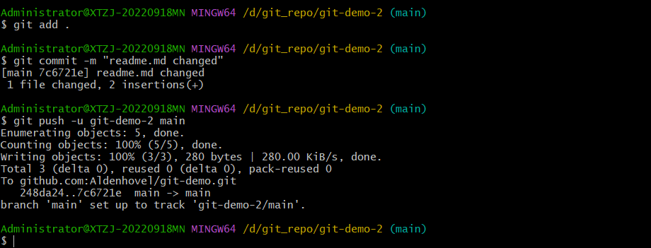

# Git 的相关指令和 Github 同步方法

## 0 目录
- [Git 的相关指令和 Github 同步方法](#git--------github-----)
  * [0 目录](#0---)
  * [1 本地的 Git 仓库管理](#1-----git-----)
  * [2 Github 的仓库管理](#2-github------)
  * [3 （新建）远程 Github 仓库与本地仓库关联](#3--------github----------)
    + [3.1 创建 github 仓库](#31----github---)
    + [3.2 创建本地仓库](#32-------)
    + [3.3 配置SSH](#33---ssh)
    + [3.4 同步远程到本地](#34--------)
    + [3.5 本地库的修改，提交与远程同步](#35---------------)
  * [4 将 Github 仓库快速部署到本地](#4---github----------)


## 1 本地的 Git 仓库管理

......

## 2 Github 的仓库管理

......

## 3 （新建）远程 Github 仓库与本地仓库关联

### 3.1 创建 github 仓库

首先要在 Github 中创建一个仓库，比如说`Aldenhovel/git-demo`，采用默认的设置就好了。


### 3.2 创建本地仓库

然后我们在本地也创建一个仓库，在`git bash`中新建一个`git-demo`目录，然后使用：

```
git init
```

来初始化，这一步相当于新增了`.git`组件，把这个目录变成 git 仓库，默认的分支参数是`master`。

### 3.3 配置SSH

Github 与本地的通信需要使用 SSH 来验证身份，所以要生成 SSH 密钥，在`git bash`中输入（记得换成你自己的邮箱）：

```
ssh-keygen -t rsa -C "your-email@example.com"
```

然后回车即可得到生成的 SSH 密钥，存放在用户主目录下的`.ssh`下，其中生成的两个文件：

- `id_rsa` 是你的私钥，注意小心保管不要泄露。
- `id_rsa.pub`是公钥，我们在 Github 上提交的 SSH 密钥就是这个。


我们切换到对应目录下，用文本方式打开`id_rsa.pub`文件，将里面的内容复制下来。然后打开 Github 主页，在个人设置中找到`SSH and GPG keys`选项，点击`New SSH key`按钮：


将在`id_rsa.pub`中的公钥复制过来，可以改个名字方便管理，然后点击添加：


完成后就可以在列表中看到你的密钥：


### 3.4 同步远程到本地

现在我们已经有了三大法宝：

- 远程的 Github 仓库。
- 本地的 Git 仓库。
- 配置好的用于远程和本地通信的 SSH 密钥。

可以进行本地和远程的双向同步了。首先是我比较喜欢的做法：在远程创建仓库，再同步到本地，然后在本地编辑完成后推送到远程，这么做比较简单。

首先我们在 Github 上找到 `Aldenhovel/git-demo` 仓库的 SSH 地址（用 HTTPS 也可以），把地址复制下来：


前面使用`git init`会产生默认为`master`的分支，因为这是我们自己的库，先不需要考虑分支冲突的问题，所以我们直接切换到`main`分支：

```
git branch -M main
```


然后在`git bash`里面使用：

```
git remote add git-demo-origin git@github.com:Aldenhovel/git-demo.git
```

将他关联过来，这里的`git-demo-origin`是仓库名，一般远程库约定成俗叫`origin`，也可以改别的名字比如`xx-origin`（我的习惯）：


现在本地库和远程库就产生了关联。

### 3.5 本地库的修改，提交与远程同步

假设我们现在每日的工作是在本地库做修改，完成后再统一推送到远程，这个过程需要使用三个步骤对应三个命令 `add` `commit` `push`：

1. `add` 将新的、修改过的文件提交到本地的缓冲区。
2. `commit` 将缓冲区的文件提交到本地库并完成本地更改。
3. `push` 将本地库推送到远程库完成同步。

为什么需要 `add` 和 `commit` 分开，这是为了数据修改安全所设计的步骤逻辑，即所有修改要么一次全部改完要么完全不动，以防止修改过程中出现的突发情况导致文件部分修改而混乱（数据库的内容）。

我们尝试编辑一个`readme.md`文档并把它推送到 Github，随便写点东西：


使用`add`命令可以将文件添加到缓冲区，可以逐个文件添加，也可以在库的主目录下使用`.`将整个库添加：

```
git add .
```

然后用`commit`命令提交到本地库，注意`-m`是评论参数，你需要对你的提交加一点说明：

```
git commit -m "version 0.1"
```

最后使用`push`命令进行远程同步：

```
git push -u git-demo-origin main
```


没有出什么差错就好:pig:。最后我们检查 Github 发现信息已经同步过去啦：


## 4 将 Github 仓库快速部署到本地

前面的是从0开始先建立 Github 仓库，再关联本地，最后在本地编辑项目并同步到本地。多数时候我们不需要从0开始建立仓库，而是在新的设备上将 Github 上的库拉下来开始上手干活。这里我们假设在本地建立一个`git-demo-2`仓库，并同步远程`Aldenhovel/git-demo`仓库。

使用`git clone`指令将远程仓库克隆到本地，因为我们现在已经有了一个`git-demo`本地库了，需要重新指定本地库名以防止冲突：

```
git clone git@github.com:Aldenhovel/git-demo.git git-demo-2
```


然后我们将这个新的库与`Aldenhovel/git-demo`远程库做关联：

```
git remote add git-demo-2 git@github.com:Aldenhovel/git-demo.git
```


后面就与前面的步骤一样啦，首先我们修改下`readme.md`：


然后，使用`add` `commit` `push` 来推送同步：

```
git add .
```

```
git commit -m "readme.md changed"
```

```
git push -u git-demo-2 main
```



完成，没有报错:pig:，去 Github 上检查下，发现已经同步成功：

